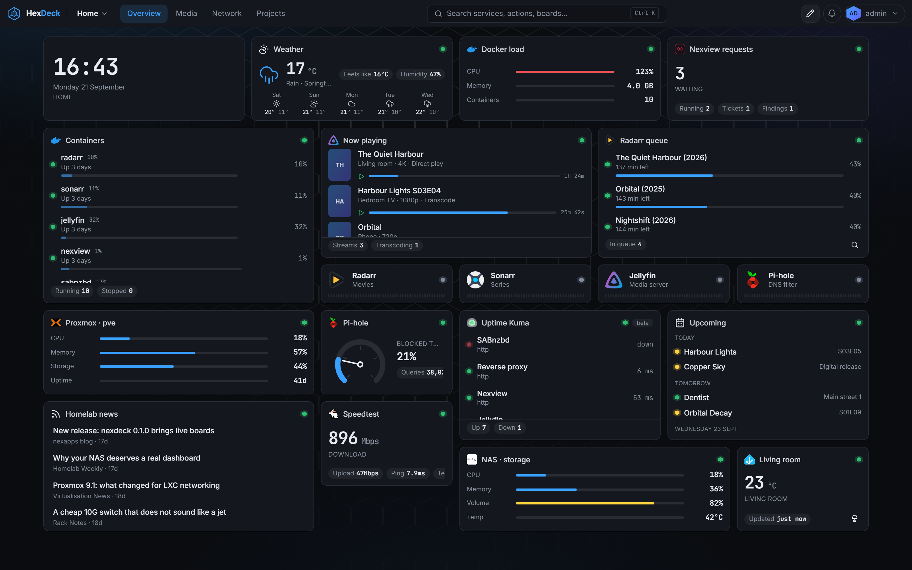
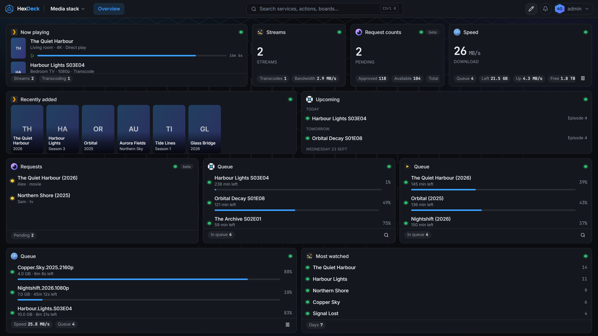
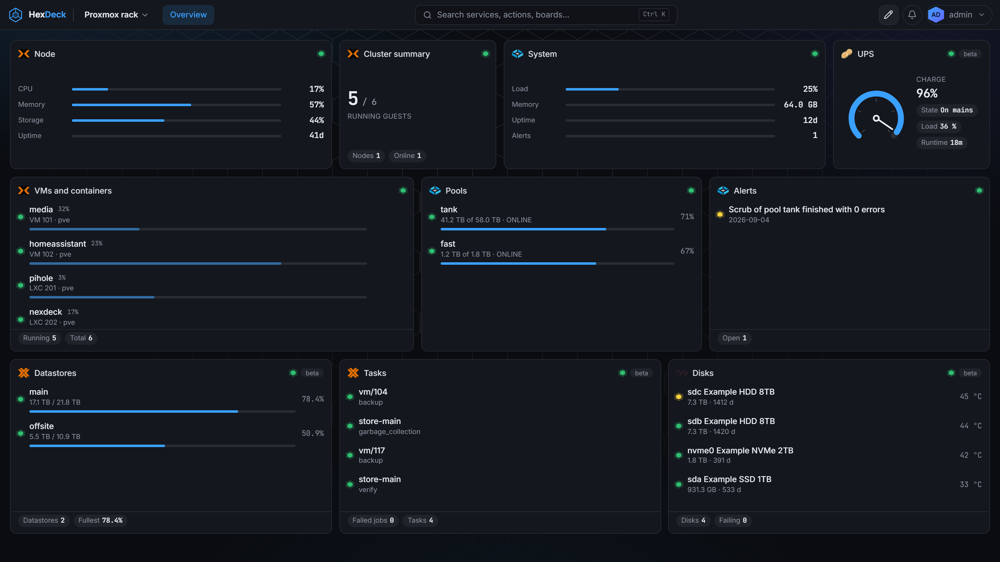
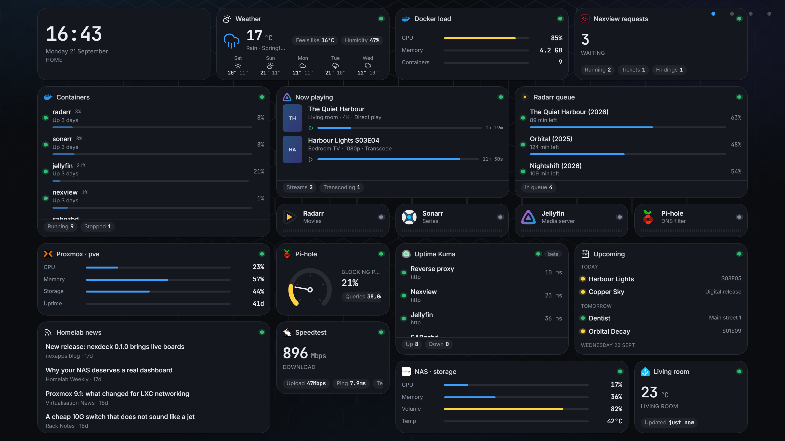

# HexDeck

**The live homelab dashboard.** Cards that move, actions on the cards, boards for the desk, the phone and the wall.

[](https://github.com/HexLions/hexdeck/actions/workflows/ci.yml)
[](https://github.com/HexLions/hexdeck/pkgs/container/hexdeck)
[](LICENSE)
[](#the-services-it-speaks-to)

HexDeck is a fork of [nexdeck](https://github.com/DerKezorm/nexdeck) by DerKezorm, licensed under AGPL-3.0. The fork point, the copyright notices and the list of changes are in [NOTICE.md](NOTICE.md).



## What it does

- **Live, not polled by your browser.** The server asks every service in its own rhythm and pushes changes to every open browser. Ten tabs cost a service one request.
- **A hundred and twenty-seven integrations,** listed in full [further down](#the-services-it-speaks-to). Generic building blocks for everything else: a JSON API widget, a calendar that merges several sources, iframes, notes and bookmarks.
- **Actions where the data is.** Restart a container, start a VM, pause downloads, approve a request, wake a machine, flip a light. Destructive actions confirm once. Everything is logged.
- **Three screens.** A free grid you arrange once: a tablet shows it as arranged, a phone stacks the cards in the same order. An installable phone app with a bottom bar, and kiosk links for wall tablets that cycle pages and dim at night.
- **Users, roles and sharing.** Administrators, users and guests. Boards are private, shared with people or with a whole role, at view, edit or act level.
- **Reachability and notifications.** App tiles carry a check with uptime bars; outages reach you through Telegram, e-mail, Web Push, ntfy, Gotify, Discord, Slack or Apprise.
- **Boards as files.** Export a board as YAML, keep it in Git, drop it into `data/boards/` to provision it. Docker labels create tiles.
- **Templates to start from.** Five ready-made boards (homelab overview, media stack, Proxmox rack, network, projects) under Settings › Boards. Pick which of your connections stand in for the template's; one left out takes its cards with it.
- **GitHub, properly.** Issues, pull requests and their review state, workflow runs and milestones of the repositories you watch, or of the ones a project links. Answers are cached with ETags so the sixty requests an hour GitHub allows without a token go a long way; a token in the GitHub connection makes it five thousand.
- **Projects and a roadmap.** Milestones, items and linked repositories kept in HexDeck itself; a roadmap card shows what is due in the next weeks, a project card its state, an items card what to tick off, on any board. An item can be maintenance that comes back every so many days: tick it, and it returns with its next date; what is due is announced once a day.
- **Sign in your way.** Local accounts, OpenID Connect (authentik, Keycloak, Authelia, Pocket ID and friends), personal API tokens.

## A board is whatever you put on it

Every card is a widget of one integration, dropped on a free grid and sized by hand. The templates are a starting point, not a mould: what they make is an ordinary board.

Each board chooses its own grid: 12, 24 or 36 columns for how finely cards can be placed, a width (1480 px as before, the whole screen, or a number), and whether the rows stretch so the page fills the window without scrolling. Boards from before keep their 12 columns and look exactly as they did.

### Media

What is playing, what the library holds, what is on its way in, and the covers of what arrived last. And your own music: a player card plays the library of Plex, Jellyfin or Emby in the browser, keeps playing from board to board, and edits playlists on the server.



### Infrastructure

The same grid, a different question. Hosts, containers, pools, disks, certificates and what answers.



### On the wall

A kiosk link opens one board without a sign-in, read-only unless you say otherwise. It cycles through the pages and dims at night. The token is handed in once at the door and never rides in an address afterwards.



## Quick start

```bash
mkdir HexDeck && cd HexDeck
curl -fsSL https://raw.githubusercontent.com/HexLions/hexdeck/main/docker-compose.yml -o docker-compose.yml
docker compose up -d
```

Open `http://your-host:5175`. The first start creates the administrator and offers a demo board with invented, moving data, so you can look around before connecting anything.

Mount `/var/run/docker.sock` (already in the compose file) to see this host's containers, act on them and follow their logs. On Synology the same socket serves Container Manager.

### Configuration

| Variable | Default | Purpose |
|---|---|---|
| `HEXDECK_SECRET_KEY` | generated into `/data/secret.key` | Encrypts stored API keys and signs sessions. Set it once and keep it. |
| `HEXDECK_PUBLIC_URL` | empty | How browsers reach HexDeck. Needed for OpenID Connect and Web Push. |
| `HEXDECK_DEMO` | `0` | Start every widget with invented data. |
| `HEXDECK_LOG_LEVEL` | `INFO` | `DEBUG` logs every adapter request. |
| `HEXDECK_ALLOW_LOOPBACK_TARGETS` | `0` | Let notification channels, Web Push, RSS cards and reachability checks call `127.0.0.1`. Connections an administrator made are never affected. |
| `HEXDECK_UPLOAD_QUOTA_MB` | `200` | What one account may leave lying in `/data/uploads`. `0` means no ceiling. |
| `HEXDECK_KEEP_ACTION_LOG_DAYS` | `90` | How long the record of who pressed what is kept. `0` keeps it forever. |
| `HEXDECK_KEEP_NOTICES_DAYS` | `90` | How long messages in the notice centre are kept. |
| `HEXDECK_KEEP_OUTAGES_DAYS` | `365` | How long finished outages are kept. A running one is never swept. |
| `PUID`, `PGID` | `1000` | Owner of the files in the data volume. |
| `DOCKER_GID` | detected | Group of the mounted Docker socket, when detection fails. |

Rarely needed, but real:

| Variable | Default | Purpose |
|---|---|---|
| `HEXDECK_DATA_DIR` | `/data` | Where the database, the key file, uploads and caches live. |
| `HEXDECK_STATIC_DIR` | set in the image | The built frontend. Empty means the API only. |
| `HEXDECK_COOKIE_SECURE` | `auto` | `auto` sets the Secure flag when the request came over HTTPS; `always` and `never` force it. |
| `HEXDECK_SESSION_DAYS` | `30` | Days a browser stays signed in without activity. |
| `HEXDECK_BCRYPT_ROUNDS` | `12` | Cost of a password hash. Lower is faster and weaker. |
| `HEXDECK_DB_POOL_SIZE` | `20` | Database connections held open. |
| `HEXDECK_DB_MAX_OVERFLOW` | `20` | How many more may be opened under load. |
| `HEXDECK_REQUEST_THREADS` | `24` | Worker threads for synchronous routes. Keep it below the two above added together. |
| `HEXDECK_HISTORY_RAW_HOURS` | `1` | How long raw samples are kept before they become minute averages. |
| `HEXDECK_HISTORY_MINUTE_HOURS` | `24` | How long those minute averages are kept. |
| `HEXDECK_LOG_HISTORY_HOURS` | `6` | How long container log lines are kept. |
| `HEXDECK_HEALTH_INTERVAL_SECONDS` | `30` | Default interval for reachability checks. |
| `HEXDECK_OUTAGE_THRESHOLD_SECONDS` | `120` | How long a service must be down before an outage is announced. |
| `HEXDECK_ICON_CACHE_DAYS` | `30` | How long a fetched logo is kept. |
| `HEXDECK_UPDATE_CHECK` | `0` | Ask GitHub whether a newer HexDeck exists. Off by default: it is an outbound call. |
| `HEXDECK_CORS_ORIGINS` | empty | Origins allowed to call the API from a browser. `*` is refused at start-up, because with credentials it would let any site act as the signed-in user. |
| `HEXDECK_BACKUP_EVERY_HOURS` | `24` | How often a snapshot is written by itself. `0` switches it off. |

A guard test keeps this table in step with the settings in the code.

### Reverse proxy

HexDeck speaks plain HTTP on port 8000 and trusts `X-Forwarded-Proto` for its cookies. Server-Sent Events need a proxy that does not buffer: for nginx, `proxy_buffering off;` on the location; Traefik and Caddy need nothing.

### Two things to decide before the first start

**`HEXDECK_SECRET_KEY` encrypts every stored API key.** Set it yourself on the first start and keep it somewhere safe. Left empty, HexDeck generates one into `/data/secret.key`; lose that file and every connection has to be entered again. Backups leave the key out on purpose, so a restore on another machine needs the same variable.

**A writable Docker socket is root on the host.** Whoever can act on a board that has Docker cards can start, stop and read the logs of any container, which is a step from root on the machine. Mount the socket only if you want those buttons. To see states and logs without handing over the socket, run a read-only proxy such as `tecnativa/docker-socket-proxy` next to HexDeck and point the Docker connection at `tcp://socket-proxy:2375`; with `CONTAINERS=1` and nothing else enabled, the cards show but the buttons refuse.

### TrueNAS SCALE

Install HexDeck as a Custom App (Apps → Discover Apps → Install via YAML) with this compose:

```yaml
services:
  hexdeck:
    image: ghcr.io/hexlions/hexdeck:main
    container_name: hexdeck
    restart: unless-stopped
    ports:
      - "5175:8000"
    volumes:
      - /mnt/POOL/apps/hexdeck/data:/data
      - /var/run/docker.sock:/var/run/docker.sock
    environment:
      - HEXDECK_SECRET_KEY=generate-one-and-keep-it
      - HEXDECK_PUBLIC_URL=http://truenas.lan:5175
      - PUID=1000
      - PGID=1000
```

- Paths are absolute, under `/mnt/<pool>/…`; make the dataset first, or Docker creates the directory as root and `PUID`/`PGID` fix its ownership on the first start.
- `PUID`/`PGID` are the owner of the files in the data volume; use the user that owns the dataset.
- The Docker socket's group is detected at start. When that fails (the log says so), set `DOCKER_GID` to the group id of `/var/run/docker.sock` on the host, or leave the socket out.
- `:main` is the newest build; a release tag such as `:0.17.0` stays put.

For the **TrueNAS card itself**, use `https://` and an API key **linked to a user** with the Read-Only Administrator role, not a full administrator's. Over https HexDeck speaks the current JSON-RPC API, which is what TrueNAS 25.04 and later expect; the old REST API is refused on those versions, because every call to it raises a deprecation alert on the NAS and TrueNAS 26 removes it.

## The services it speaks to

**Hosts and containers.** Docker, Proxmox VE, Proxmox Backup Server, Kopia, Duplicati, Portainer, Nomad, Cup, Coolify, Gitea, Forgejo, Semaphore UI, Meilisearch, Synology DSM, Unraid, TrueNAS, Glances, Beszel, Prometheus, Grafana, Scrutiny, UPS through PeaNUT, Wake-on-LAN, Backrest, Komodo, Netdata, Ollama, Open WebUI, Watchtower, What's Up Docker, Zabbix.

**Network.** UniFi, MikroTik, FRITZ!Box, OPNsense, pfSense, Traefik, Nginx Proxy Manager, Pi-hole, AdGuard Home, Technitium, NextDNS, Tailscale, Headscale, wg-easy, NetBox, Gluetun, authentik, CrowdSec, Shlink, Speedtest Tracker, nexpulse, Uptime Kuma, Healthchecks, ChangeDetection.io, n8n, Blocky, Gatus, NetAlertX, Pocket ID.

**Media.** Plex, Jellyfin, Emby, Tautulli, Jellystat, Radarr, Sonarr, Lidarr, Readarr, Prowlarr, autobrr, Bazarr, SABnzbd, NZBGet, qBittorrent, Transmission, Deluge, Seerr, Overseerr, Jellyseerr, Nexview, Maintainerr, Tdarr, Unmanic, FileFlows, RomM, Sportarr, Tube Archivist.

**Home and files.** Home Assistant, Frigate, Reolink, evcc, Immich, Nextcloud, Syncthing, Paperless-ngx, Firefly III, Mealie, Grocy, Vikunja, Kimai, Dawarich, wger, Audiobookshelf, Navidrome, Komga, Kavita, Calibre-Web, BookOrbit, Ghostfolio, Homebox, PhotoPrism, Tandoor Recipes, Wallos.

**Feeds, weather and messages.** Hacker News, YouTube, GitHub releases, share prices, Twitch, RSS, Miniflux, Karakeep, Linkwarden, iCal, Weather, ntfy, Gotify, nexmail.

Adapters that have not been confirmed against a live instance yet carry a *beta* badge in the interface. If one misbehaves, please open an issue with the service's version.

## Documentation

- [Running HexDeck: backups, restoring, updating](docs/operating.md)
- [Integrations and widgets](docs/adapters.md)
- [Docker labels](docs/labels.md)
- [Boards as files and provisioning](docs/provisioning.md)
- [Kiosk displays](docs/kiosk.md)
- [API](docs/api.md)

## Development

Backend: Python 3.13, FastAPI, SQLAlchemy, SQLite. Frontend: React 19, Vite 7, Tailwind 4.

```bash
# backend
cd backend
python -m venv .venv && . .venv/bin/activate
pip install -r requirements-dev.txt
uvicorn app.main:app --reload --port 8000

# frontend, in a second terminal
cd frontend
npm ci
npm run dev
```

The frontend on `http://localhost:5176` proxies `/api` to the backend. Tests: `python -m pytest` in `backend/`, `npm test` and `npm run e2e` in `frontend/`. The whole CI set, read from the workflow: `python tools/ci_local.py` in `backend/` (`--tag vX.Y.Z` adds the version check, `--install` the installs). The guards in `backend/tests/test_guards.py` and `frontend/src/i18n/*.test.ts` enforce English messages, complete translations, an auth decision on every address and no personal data in the repository.

### Adding an adapter

One file in `backend/app/adapters/`: declare the connection fields and the widgets, implement `test`, `fetch`, optionally `action`, and `demo`. Every widget maps onto one of thirty-one renderers, so no frontend code is needed. See [docs/adapters.md](docs/adapters.md).

## License

AGPL-3.0-or-later. See [LICENSE](LICENSE).
